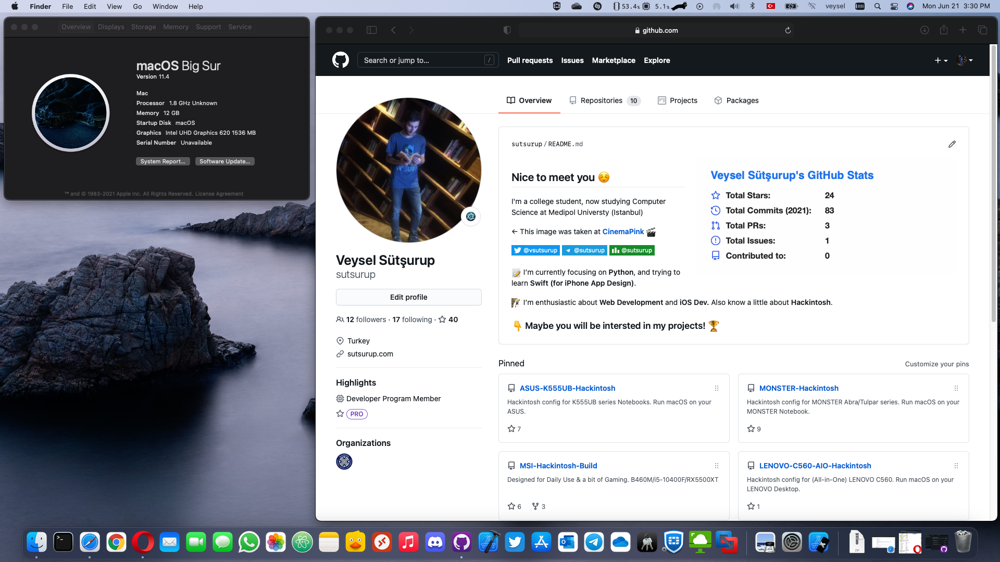

# Lenovo V330-14IKB 14" | Intel i5 (8250U)

[](https://www.apple.com/tr/macos/big-sur/)
[](https://github.com/acidanthera/OpenCorePkg)
[](https://github.com/sutsurup/Lenovo-V330-Hackintosh/releases)


Türkçe | [English](https://github.com/sutsurup/ASUS-K555UB-Hackintosh/blob/master/README_EN.md)

**macOS Versiyonu: 11.4**

**OpenCore Versiyonu: 0.7.0**

Yardımcı olabilecek kaynaklar: 

- [OpenCore Yükleme Rehberi](https://dortania.github.io/OpenCore-Install-Guide)


# Detaylar

    Tarih:        Mayıs 21, 2021
    Durum:        Stabil
    Destek:       BIOS (429.100.7.0.0)
    Yapı:         OpenCore

## Donanım

| **LENOVO** | Detay                                                  |
| ------------------- | ------------------------------------------- |
| Model Ismi      | Lenovo V330-14IKB      |
| Anakart           | 	Lenovo V330     |
| CPU              | Intel(R) Core(TM) i5-8250U CPU @ 1.60GHz KabyLake R              |
| RAM           | 2400 MHz onBoard 4 GB + BigBoy 8GB DDR4 2666 MHz SODIMM (Total: 12GB)   |
| Dahili Grafik Kartı | Intel(R) UHD Graphics 620 (1 GB)                    |
| Wi-Fi | Intel(R) Dual Band Wireless-AC 3165                |
| Ses       | Conexant CX20751/2 (Layout: 3)                        |
| BIOS Versiyonu      | 429.100.7.0.0                   |


## Uyumluluk
**macOS Big Sur 11.4** sürümünde çalışmaktadır. 11.4 sürümlerine kadar güncelleme yapabilirsiniz.
Direk 11.4 yüklenmediğinden dolayı, orijinal Apple dosyaları ile ilk 10.15.7 temiz kurulum yaptım, üzerine 11.4'e güncelledim.
Releases bölümünde EFI klasörü için zip dosyası paylaştım. macOS kurulum belleğinizdeki EFI için ayrılan disk bölümünde, EFI adında bir klasör oluşturun ve zip içerisindeki BOOT ve OC klasörlerini EFI klasörü içerisine kopyalayınız.
macOS High Sierra 10.13.6, Mojave 10.14.6, Catalina 10.15.7, macOS Big Sur 11.4 sürümlerinde çalıştırmayı deneyebilirsiniz

### Çalışıyor

- [x] Uyku
- [x] Ethernet (Yama yapıldı)
- [x] Wi-Fi + Bluetooth (openIntelWireless, HeliPort'suz)
- [x] Ses ve Mikrofon (Layout: 3)
- [x] Batarya yüzde göstergesi

### Çalışmıyor
- [ ] Ekran parlaklığı
- [ ] HDMI (tam anlamıyla çalışmıyor)


## Kurulum sonrası yararlanabileğiniz rehber bağlantıları
* önerilir: iCloud'a giriş yapacaksanız veya iMessage, FaceTime kullanmak istiyorsanız, bu rehberi harfiyen uygulayın: [OpenCore ile iMessage ve Apple Servislerini Aktif Etmek](https://osxinfo.net/konu/opencore-ile-imessage-ve-apple-servislerini-aktif-etmek.16297/) (Bu rehberde Clover Configurator gösterilmiş, siz OpenCore Configurator kullanacaksınız, Clover Configurator üzerinden takip edin, verileri OpenCore Configurator aracılığıyla config.plist dosyanıza girin)
* [ProperTree](https://osxinfo.net/konu/propertree-opencore-bootloader-icin-config-duzenleyici.12919/) (config.plist düzenlemek için)
* Hackintool ([Forum thread](https://www.insanelymac.com/forum/topic/335018-hackintool-v286/) | [Direkt indirme linki](http://headsoft.com.au/download/mac/Hackintool.zip)) (Detaylı sistem bilgileri öğrenme ve düzenlemeleri için)

## İletişime geçin
Herhangi bir adımda sorun yaşıyorsanız, öncelikli olarak [issue](https://github.com/sutsurup/Lenovo-V330-Hackintosh/issues) bölümüne destek talebi açın! Diğer sorularınız için, Website: http://sutsurup.com // Mail: [veyselfurkan@icloud.com](mailto:veyselfurkan@icloud.com)

## Ekran Görüntüleri


</details>

## Destek olun.
Projeyi faydalı bulduysanız, kaynak bulma konusunda bana yardımcı olmak için bağış yapabilirsiniz:
```
₿ 1Q8CEMHTuecxPUJpEdpRiG6Bg2GVtzw4bN
``` 
<a href='https://github.com/sutsurup/sutsurup/blob/main/Donate.md'></a>
```
QR koda tıklayarak alternatif seçeneklere ulaşabilirsiniz
``` 
